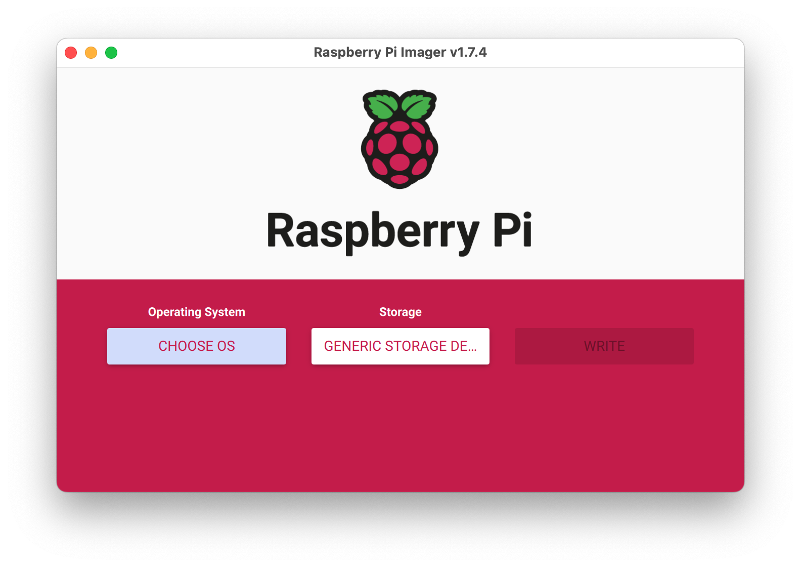
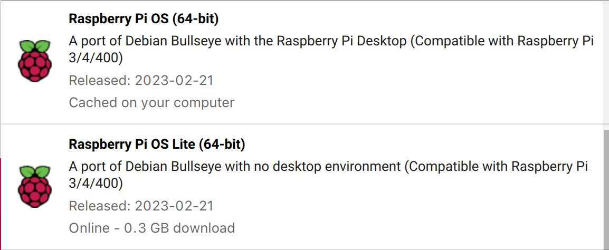

# pi-hole
Documentation and scripts for pi-hole

## Environment 

Raspberry Pi 4 Model B 2 GB
- [Specifications](https://www.raspberrypi.com/products/raspberry-pi-4-model-b/specifications/)
- [Raspberry Pi 4 Model B product brief](https://datasheets.raspberrypi.com/rpi4/raspberry-pi-4-product-brief.pdf)
- [Raspberry Pi 4 Model B schematic diagrams](https://datasheets.raspberrypi.com/rpi4/raspberry-pi-4-reduced-schematics.pdf)
- [Raspberry Pi 4 Model B mechanical drawing](https://datasheets.raspberrypi.com/rpi4/raspberry-pi-4-mechanical-drawing.pdf)
- [Documentation including hardware and configuration](https://datasheets.raspberrypi.com/rpi4/raspberry-pi-4-mechanical-drawing.pdf)

## Setup the PI

The following sections cover the setup that I did for the Pi and Pi-hole

### Setting up the PI OS

1. Need to install the PI OS and flash the SD card do this with the Raspberry Pi Imager
   - Download and install the Raspberry Pi Imager [here](https://www.raspberrypi.com/software/)

2. Run Raspberry Pi Imager

3. Select the OS
   - I am running "Raspberry PI (64 bit)" or the "Lite" version depending on if I don't want a desktop and will be 
      running it headless. 
   - Note: since I run it as a server I am running lite.
   - These are based on Debian

4. Select the storage device to write to. (SD card)
5. Click the gear icon and make sure settings are how you want them to be.
   - Enable SSH
   - Setup user and password
   - Enable/disable wireless (Note - I disable wireless and do not prefill it for the pi-hole it will be using ethernet)
6. Click write
   - took between 10-20 minutes
   - eject the card and put it into the Pi
7. Connect to either NET
8. Power on the Pi
   - note it may take initially 3 minutes for this. Connect a monitor to see what the pi is doing.
``
### Install pi-hole
- [Pi-hole](https://pi-hole.net/)
- [Pi-hole documentation](https://docs.pi-hole.net/)
- [Install steps](https://github.com/pi-hole/pi-hole/#one-step-automated-install)

1. SSH into Pi
 ```bash
  ssh admin@192.168.68.116
 ```
  - Note: I have setup reservation for the IP for the MAC address of the Pi.

2. Run install script
 ```bash
  curl -sSL https://install.pi-hole.net | bash
 ```

 When running it. I choice the following options
 - ethernet connections 
 - need a static ip address for the pi on the local network.
 - Quad9 Filtered + ECS
 - install web admin tools. (Note: Write down web admin site and the password)

4. OPTIONAL setup the default resolver for DNS on the Pi
- only do this if you want the pi to use itself for resolving addresses.
- WARNING if the pi-hole configuration is messed up you may have problems with resolving web address on the pi.
 ```bash
  sudo nano /etc/resolv.conf
 ```
Change the following in the file.
 ```bash
   nameserver 2001:558:feed::1
   nameserver 2001:558:feed::2
 ```
 to:
 ```bash
   nameserver 127.0.1.1
 ```

## pihole cli commands
- [pihole-command](https://docs.pi-hole.net/core/pihole-command/)
- [pi-hole-quick-reference-commands](https://kb.adamsdesk.com/application/pi-hole-quick-reference-commands/)

## Making your networks ip addresses on web admin tool resolve to names.
For my setup I am just running the pi-hold as a DNS service not a DHCP service. This is because my consumer level TP-Link network/WI-FI has to do DHCP.

This results in the web admin listing out IP's for all the hosts. Which I would rather have names of the host. To get around this I do the following.

1. Configure all my networked devices to have static ip addresses.
2. edit the `/etc/hosts` file on the pi to add your IP Device-names 
```bash
sudo nano /etc/hosts
```

Example:
```bash
127.0.0.1	localhost
::1		localhost ip6-localhost ip6-loopback
ff02::1		ip6-allnodes
ff02::2		ip6-allrouters

127.0.1.1	raspberrypi
192.168.68.100  Hounds-computer
```

## Bypass pi-hole by MAC address
The pi-hole web admin interface has a lot of options like bypassing filtering for a mac address.

## Setting up router to block adds for all devices
I am running TP-Link Deco M5. I have them configured to only do IPv4 routing. 

See the following for changing the DNS server to the pi-hole ip address

- [How to change DNS server settings on my Deco](https://www.tp-link.com/us/support/faq/1855/)

Note: I set the primary and secondary address both to the IP of the pi-hole.

## Auto updates of gravity lists
pi-hole updates gravity, once a week.

Pi-hole uses a cron job to update gravity (/etc/cron.d/pihole).

The time for this job is set on installation, but you can change when the job runs to meet your own requirements.

## manually updating the pi and pi-hole
You might want to manually update the pi and pi-hole from time to time.

1. to update pi-hole run.
 ```bash
  # answer any prompts
  pihole -up
 ```
This updates the packages that are used by pi.
- Note: I usually do this when the web admin tool says I am out of date.


2. To update all the Raspberry Pi install packages
 ```bash
  # answer any prompts
  sudo apt update
  sudo apt full-upgrade
  sudo reboot
 ```
- Note usually run this when there is a security patch for the os.

If you run into issues with above that the file is locked run the following.
 ```bash
   sudo touch /forcefsck
   subo reboot
 ```
